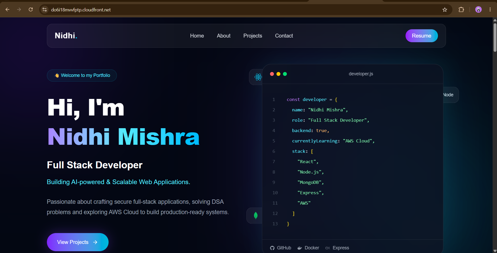
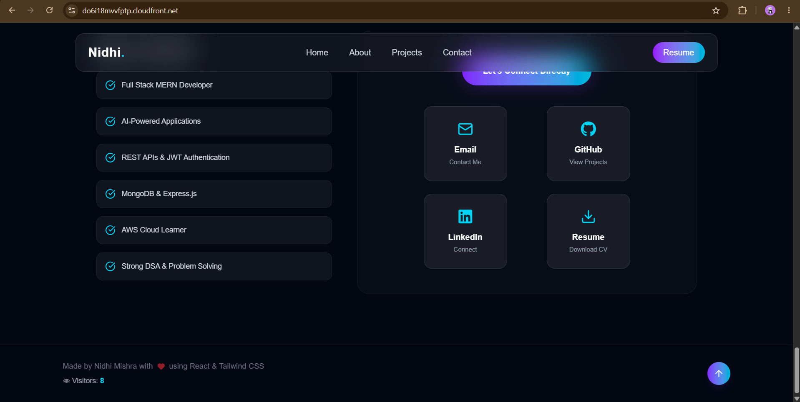
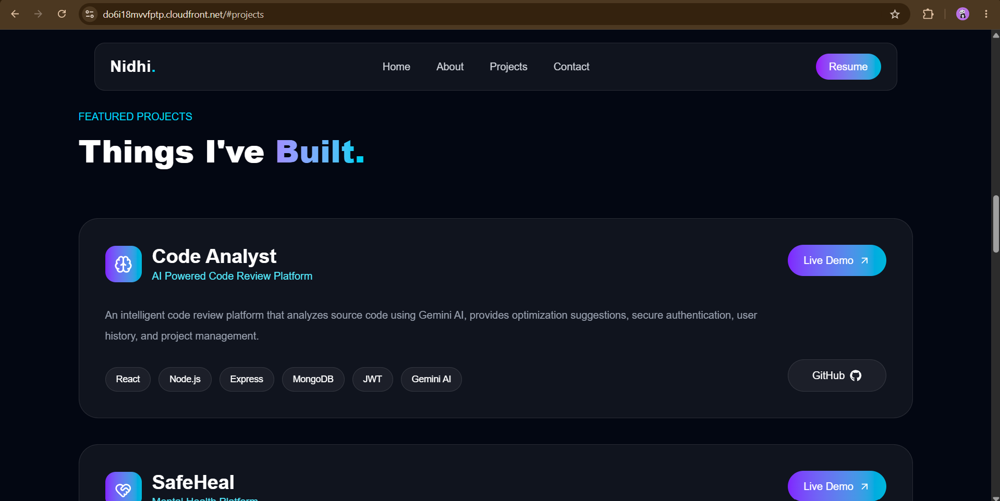
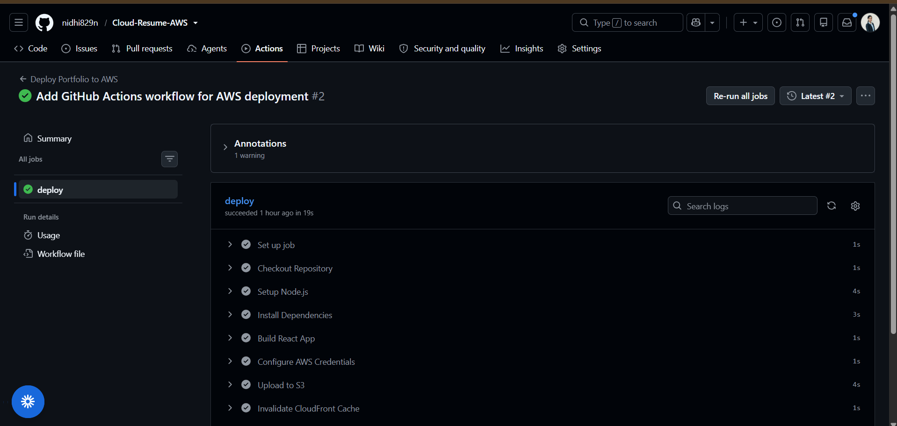
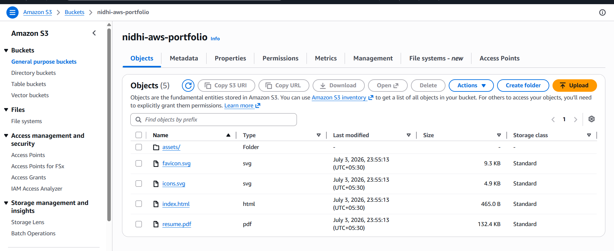
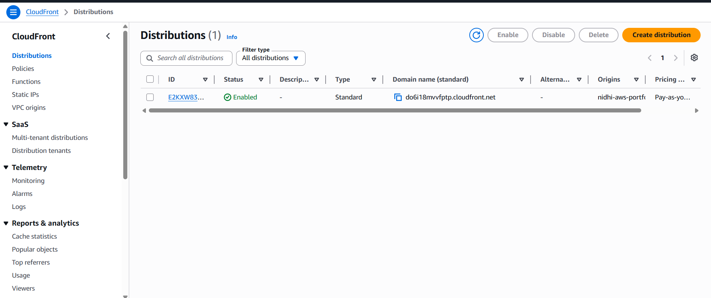
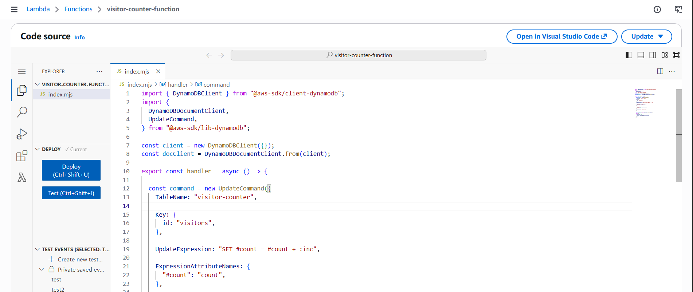
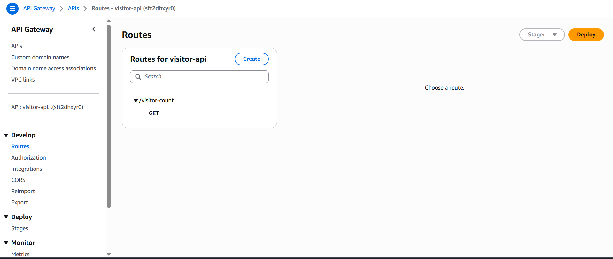
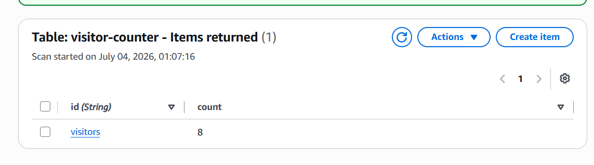

<div align="center">

# ☁️ AWS Cloud Resume Challenge

[](https://github.com/nidhi829n/Cloud-Resume-AWS)
[](https://do6i18mvvfptp.cloudfront.net)
[](https://github.com/nidhi829n/Cloud-Resume-AWS/actions/workflows/deploy.yml)
[](https://opensource.org/licenses/MIT)

*A production-ready, serverless cloud portfolio built with React and AWS.*

</div>

<div align="center">

### 🚀 Experience It Live

[](https://do6i18mvvfptp.cloudfront.net)
[](https://github.com/nidhi829n/Cloud-Resume-AWS)

</div>

# 📖 Project Overview

This project is based on the **AWS Cloud Resume Challenge**, where a personal portfolio website is deployed using AWS cloud services instead of traditional hosting.

The frontend is hosted in an Amazon S3 bucket and delivered globally through Amazon CloudFront. A serverless backend built using API Gateway, AWS Lambda, and DynamoDB maintains a live visitor counter that updates every time the portfolio is accessed.

The entire deployment process is fully automated using GitHub Actions, allowing every push to the main branch to automatically build and deploy the latest version of the portfolio.

---

# ✨ Features

- Responsive React Portfolio
- Amazon S3 Static Website Hosting
- Amazon CloudFront CDN
- Serverless Visitor Counter
- AWS Lambda Backend
- Amazon API Gateway
- Amazon DynamoDB Integration
- Automated CI/CD using GitHub Actions
- Responsive UI built with Tailwind CSS
- Resume Download
- Smooth Animations
- Fast Global Content Delivery

---

# 🏗️ Architecture

<p align="center">

</p>

---

# 🚀 Request Flow

```text
User
   │
   ▼
CloudFront
   │
   ▼
Amazon S3
   │
   ▼
React Portfolio
   │
fetch(API)
   │
   ▼
API Gateway
   │
   ▼
AWS Lambda
   │
   ▼
Amazon DynamoDB
   │
   ▼
Updated Visitor Count
```

---

# ⚙️ CI/CD Pipeline

Every push to the **main** branch automatically triggers the deployment pipeline.

```text
Developer

↓

Git Push

↓

GitHub Repository

↓

GitHub Actions

↓

Install Dependencies

↓

Build React App

↓

Upload dist → Amazon S3

↓

CloudFront Cache Invalidation

↓

Live Website Updated
```

---

# ☁️ AWS Services Used

| Service | Purpose |
|----------|---------|
| Amazon S3 | Static website hosting |
| Amazon CloudFront | Global CDN and caching |
| AWS Lambda | Serverless backend |
| Amazon API Gateway | HTTP API endpoint |
| Amazon DynamoDB | Visitor counter storage |
| AWS IAM | Secure permissions management |
| GitHub Actions | Automated CI/CD |

---

# 🛠️ Tech Stack

### Frontend

- React
- Vite
- Tailwind CSS
- JavaScript

### Cloud

- Amazon S3
- Amazon CloudFront
- AWS Lambda
- Amazon API Gateway
- Amazon DynamoDB
- AWS IAM

### DevOps

- Git
- GitHub
- GitHub Actions

---

# 📸 Project Screenshots

## 🏠 Home Page



---

## 👁️ Visitor Counter



---

## 💻 Projects Section



---

## 🚀 GitHub Actions



---

## ☁️ Amazon S3



---

## 🌍 Amazon CloudFront



---

## ⚡ AWS Lambda



---

## 🔗 API Gateway



---

## 🗄️ DynamoDB



---

# 📂 Project Structure

```text
Cloud-Resume-AWS/

│── .github/
│     └── workflows/
│            deploy.yml

│── public/

│── src/

│── screenshots/

│── package.json

│── vite.config.js

│── README.md
```

---

# 💻 Local Setup

Clone the repository

```bash
git clone https://github.com/nidhi829n/Cloud-Resume-AWS.git
```

Go to the project

```bash
cd Cloud-Resume-AWS
```

Install dependencies

```bash
npm install
```

Create a `.env` file

```env
VITE_API_URL=YOUR_API_GATEWAY_URL
```

Run the project

```bash
npm run dev
```

---

# 🚀 Deployment

Deployment is completely automated through GitHub Actions.

Whenever code is pushed to the **main** branch:

- Install dependencies
- Build React application
- Upload latest build to Amazon S3
- Invalidate CloudFront cache
- Deploy latest version automatically

---

# 🧩 Challenges Faced

During development, several real-world deployment challenges were encountered and resolved:

- Configured IAM permissions for Lambda to access DynamoDB.
- Fixed CORS issues between the React frontend and API Gateway.
- Debugged CloudFront cache invalidation after new deployments.
- Configured environment variables correctly for Vite using `import.meta.env`.
- Implemented GitHub Actions secrets for secure AWS authentication.
- Resolved CloudFront distribution ID configuration issues during CI/CD setup.

These challenges helped strengthen understanding of AWS services, serverless architecture, debugging, and deployment workflows.

---

# 🔮 Future Improvements

- Custom Domain using Route 53
- HTTPS with AWS Certificate Manager
- CloudWatch Monitoring
- Infrastructure as Code (Terraform/AWS SAM)
- Analytics Dashboard

---

# 👩‍💻 Author

**Nidhi Mishra**

GitHub: https://github.com/nidhi829n

---

# ⭐ If you found this project helpful, consider giving it a star!
