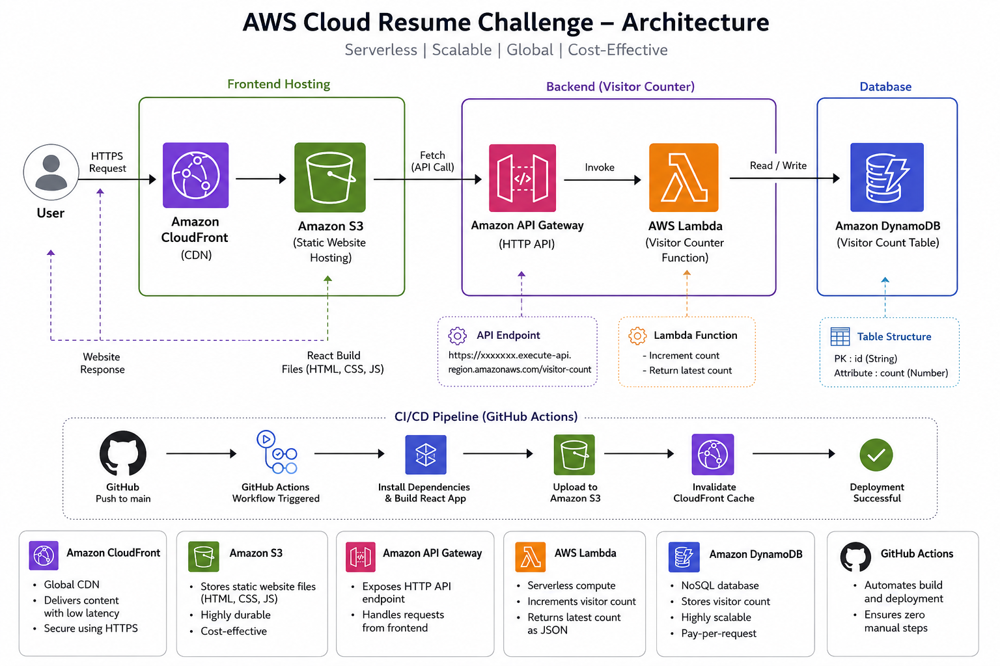

<div align="center">

# ☁️ AWS Cloud Resume Challenge

[](https://github.com/nidhi829n/Cloud-Resume-AWS)
[](https://do6i18mvvfptp.cloudfront.net)
[](https://github.com/nidhi829n/Cloud-Resume-AWS/actions/workflows/deploy.yml)
[](https://opensource.org/licenses/MIT)

*A production-ready, serverless cloud portfolio built with React and AWS.*

</div>

---

## 🧭 Quick Navigation
* [Overview](#-project-overview)
* [Features](#-features)
* [Architecture](#-architecture)
* [CI/CD Pipeline](#-cicd-pipeline)
* [AWS Services](#-aws-services-used)
* [Tech Stack](#-tech-stack)
* [Project Structure](#-project-structure)
* [Local Setup](#-local-setup--development)
* [Challenges & Solutions](#-challenges-faced--solutions)
* [Future Roadmap](#-future-improvements)

---

## 📖 Project Overview

Based on the industry-standard **AWS Cloud Resume Challenge**, this project moves away from traditional web hosting to implement a cloud-native, highly available, and scalable architecture. 

* **Frontend:** Hosted securely in an **Amazon S3** bucket and delivered globally via **Amazon CloudFront** CDN.
* **Backend:** A serverless stack leveraging **API Gateway**, **AWS Lambda**, and **DynamoDB** to track and display a persistent live visitor count.
* **Automation:** Fully automated **GitHub Actions** CI/CD pipeline ensuring seamless deployments on every code change.

---

## ✨ Features

* ⚛️ **Modern UI/UX:** Responsive design built using React, Vite, and Tailwind CSS.
* 🌐 **Global Content Delivery:** Low-latency asset distribution via CloudFront edge locations.
* 📊 **Dynamic Visitor Counter:** Real-time serverless tracking engine.
* 🚀 **Zero-Downtime Deployments:** Automated build, upload, and cache-clearing CI/CD workflow.
* 📄 **Interactive Portfolio:** Integrated resume download, smooth UI animations, and project showcases.

---

## 🏗️ Architecture

<p align="center">

</p>

### 🔄 Request Flow Sequence
```text
User 
  │
  ▼
CloudFront (CDN)
  │
  ▼
Amazon S3 (Frontend Assets)
  │
  ▼
React Portfolio ──(fetch API)──► API Gateway
                                     │
                                     ▼
                                 AWS Lambda
                                     │
                                     ▼
                                Amazon DynamoDB
                                     │
                                     ▼
                                Visitor Count Updated

